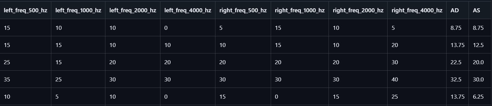
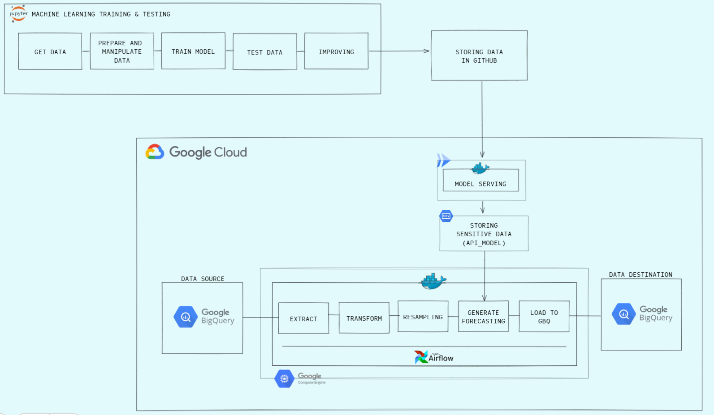
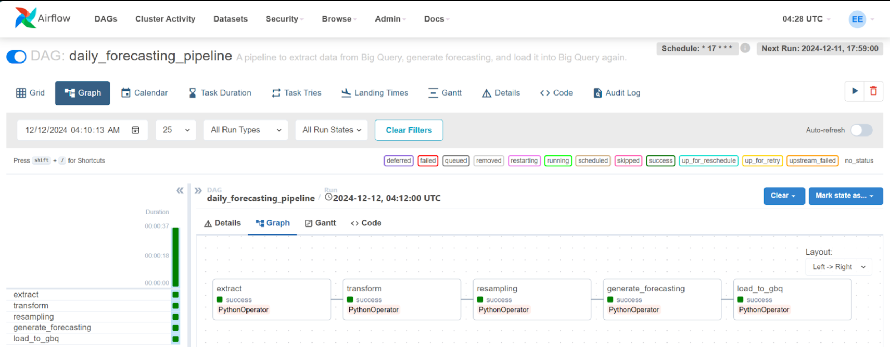
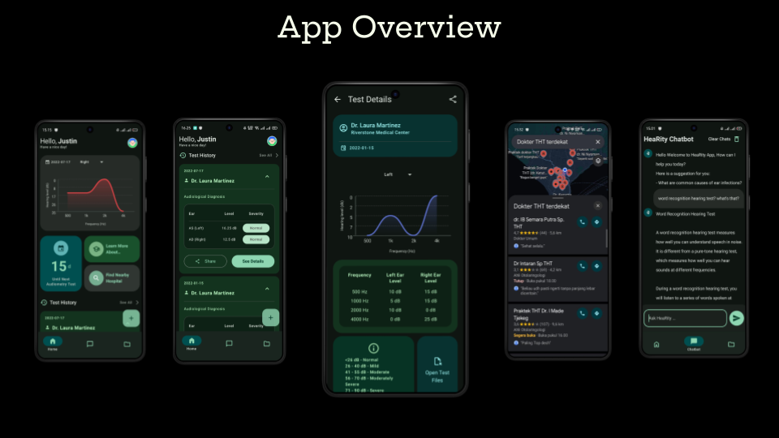

# 📅 Daily Hearing Loss Forecasting for Heavy Machinery Workers : Leveraging Machine Learning in Time Series

As a cohort from [Bangkit Academy](https://grow.google/intl/id_id/bangkit/?tab=machine-learning)
, we are required to create a capstone project in the form of a mobile application as a team. In line with my role, a machine learning cohort, all the directories I present here are my contributions to facilitating the development of this project.

**👂 Hearity** is an app focused on preventing hearing loss, primarily targeting workers in noisy environments or heavy machinery sectors, where companies provide hearing tests.

### **👂🛠️ Background : Hearing Loss in Heavy Machinery Workers**

Heavy machinery workers are exposed to noisy environments (85 dB or higher) for up to 8 hours daily, which can lead to gradual hearing loss over time. Despite safety measures like earplugs and earmuffs, workers often neglect to use them due to discomfort, lack of enforcement, or a false sense of security. This gradual hearing loss is hard to detect until it becomes severe, and many workers are unaware of the irreversible nature of noise-induced hearing damage.

### **❗💡 Problem Statement** :
* **Gradual Hearing Loss 👂** : Hearing deterioration in noisy environments occurs slowly, making it hard to track without continuous monitoring.

* **Infrequent Testing 🗓️** : Hearing tests are done only every six months, leaving gaps in tracking daily noise exposure impacts.
* **Neglected Hearing Protection 🚫🦻** : Workers often neglect hearing protection, contributing to gradual hearing loss.
* **Awareness Gap ⚠️** : Workers lack awareness about the long-term effects of noise exposure and the importance of consistent hearing protection.
* **Absence of Daily Tracking 📉** : While test results provide a snapshot of hearing condition on a specific day (day-0), there’s no system to forecast or predict hearing deterioration on subsequent days (day-1 and beyond), especially with the continuous exposure to harmful noise.

### **📜 Data Overview** :
This dataset was obtained through an interview with an audiologist who previously conducted hearing tests for workers in this field. I then combined this information with my own knowledge gained from working in the industry to avoid any potential bias.

#### **Data Interval** :
- **Start Date**: 2022/01/15
- **End Date**: 2023/07/27

The dataset contains hearing test results used to track hearing deterioration over time, specifically for workers exposed to high noise environments.

*For more details, you can access the dataset [here](https://github.com/Erikszz/Hearity_Bangkit-Academy/tree/main/ml-forecasting/data).*

Below are the first 5 rows of the dataset :

### **⚔️ Language, Tools, and Depedencies ⚔️**
#### **📊 Machine Learning** : 
     - 🐍 Python
     - 📚 Pandas
     - 🔢 Numpy
     - 🔮 TensorFlow
     - ⚙️ Scikit-learn
     - 📦 Pickle
     - 📈 Matplotlib
     - ⚙️ Flask
     - 🐳 Docker
     - 🔍 logging
     - 📒 Jupyter Notebook, 📙 Google Colab

#### **🔗 Data Pipeline** :
     - 🐍 Python, 🗄️ SQL 
     - 📚 Pandas
     - 🔢 Numpy
     - 🔍 logging
     - 🐳 Docker, 🐋 docker-compose
     - 🌬️ Apache Airflow
     - ☁️ Cloud:
          - 🖥️ Google Compute Engine (VM)
          - 🔍 Google BigQuery
          - 🔑 Google Secrets Manager
          - 🚀 Cloud Run

### **📇 Data Pipeline Overview** :

### **🌬️ Apache Airflow Webserver** :

### **📱 App Overview** :

### **📖 For Further Explanations** : [Detailed Explanation](https://github.com/Erikszz/Hearity_Bangkit-Academy/blob/main/Explanations-Hearity.pdf)

### **🐙 GitHub Team** : [Hearity Team's GitHub](https://github.com/hearity-capstone); **Team Repository** : [Hearity Team's Repository](https://github.com/hearity-capstone/hearity-project)